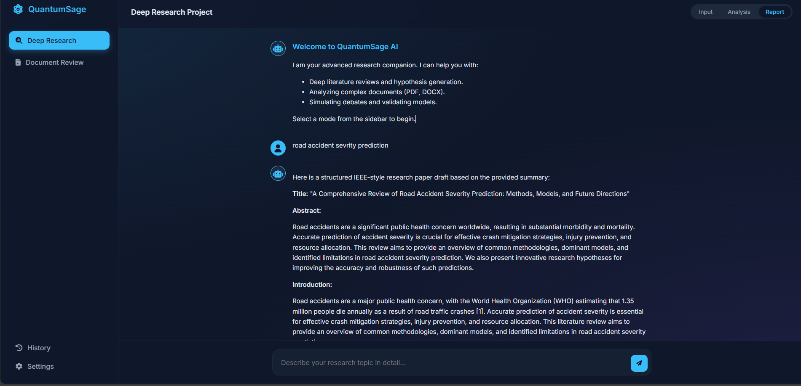

# ⚛ QuantumSage – AI Research Command Center

> A Cinematic Multi-Agent AI Research Platform for Document Review & Research Generation


---

## 🧠 Overview

**QuantumSage** is a futuristic AI-powered Research Operating System designed to streamline the academic and scientific research process. It orchestrates a team of specialized AI agents to analyze topics, review documents, and generate comprehensive research reports with a cinematic user experience.

### Key Capabilities:

- 📄 **Document Analysis**: Reviews PDF/DOCX files for executive summaries and validation.
- 📝 **Research Generation**: Creates structured research papers from a simple topic prompt.
- 🤖 **Multi-Agent Simulation**: Visualizes the collaboration between specialized AI agents.
- 📊 **Scoring System**: Evaluates publication readiness (0-100).
- ⚛ **Cinematic UI**: Features a glassmorphism design with animated interactions.

---

## 🎬 Demo



---

# 🚀 Features

## 🔹 Multi-Agent Team

The system simulates a collaborative environment with the following agents:

- **📚 Literature Agent**: Conducts deep literature reviews.
- **🧪 Hypothesis Agent**: Generates testable research hypotheses.
- **📊 Model Agent**: Simulates model training and validation.
- **⚖️ Debate Agent**: Critiques findings and evaluates accuracy.
- **📝 Report Agent**: Compiles everything into an IEEE-style paper.
- **🧠 Companion Agent**: Provides interactive feedback and guidance.

## 🔹 Document Review Mode

Upload your research papers (**PDF, DOCX, TXT**) to receive:

- Executive Summary
- Strengths & Weaknesses Analysis
- Methodology Evaluation
- Publication Readiness Score
- Improvement Roadmap

## 🔹 Research Generation Mode

Enter a research topic, and the agent team will:

- Perform a literature search.
- Formulate hypotheses.
- Simulate experimental results.
- Generate a full research report.

---

# 📂 Project Structure

```
Multi-Agent_Research_Team/
│
├── app.py                 # Main FastAPI application entry point
├── agents/                # Logic for individual AI agents
│   ├── literature_agent.py
│   ├── hypothesis_agent.py
│   ├── model_agent.py
│   ├── debate_agent.py
│   ├── report_agent.py
│   └── companion_agent.py
├── llm/                   # LLM Controller (Ollama/OpenAI)
├── memory/                # Shared memory for agent collaboration
├── storage/               # Session management (JSON saving/loading)
├── static/                # Frontend assets (HTML/CSS/JS)
│   └── index.html
├── requirements.txt       # Python dependencies
└── README.md              # Project documentation
```

---

# 🛠 Installation Guide

## 1️⃣ Clone Repository

```bash
git clone https://github.com/harshit110306/Multi-Agent_Research_Team-intel_proj-.git
cd Multi-Agent_Research_Team-intel_proj-
```

## 2️⃣ Create Virtual Environment (Recommended)

### Windows

```bash
python -m venv venv
venv\Scripts\activate
```

### Mac/Linux

```bash
python3 -m venv venv
source venv/bin/activate
```

## 3️⃣ Install Dependencies

```bash
pip install -r requirements.txt
```

_Note: Ensure you have `PyPDF2`, `python-docx`, `fastapi`, `uvicorn`, and `python-multipart` installed._

---

# 🤖 LLM Setup

QuantumSage is designed to work primarily in **Offline Mode** using **Ollama** for privacy and cost-efficiency, but can be configured for online providers.

## 🔹 Offline Setup (Recommended)

1. **Install Ollama**: Download from ollama.com.
2. **Pull the Model**:
   ```bash
   ollama pull llama3.2
   ```
3. **Start Ollama**:
   ```bash
   ollama serve
   ```

---

# ▶️ Run Application

Start the FastAPI server:

```bash
python app.py
```

Or using Uvicorn directly:

```bash
uvicorn app:app --reload
```

Open your browser and navigate to:
**`http://127.0.0.1:8000`**

---

# 👨‍💻 Author

**Harshit Bodala**

---

# ⭐ Support

If you find this project useful for your research or development:

- ⭐ Star the repository on GitHub
- 🍴 Fork it and contribute
- 🚀 Share it with your network

---

# 📜 License

MIT License
